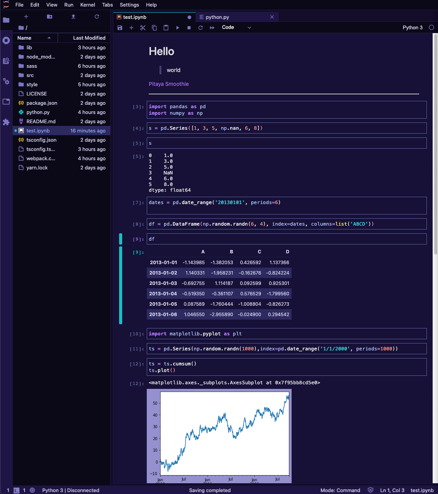
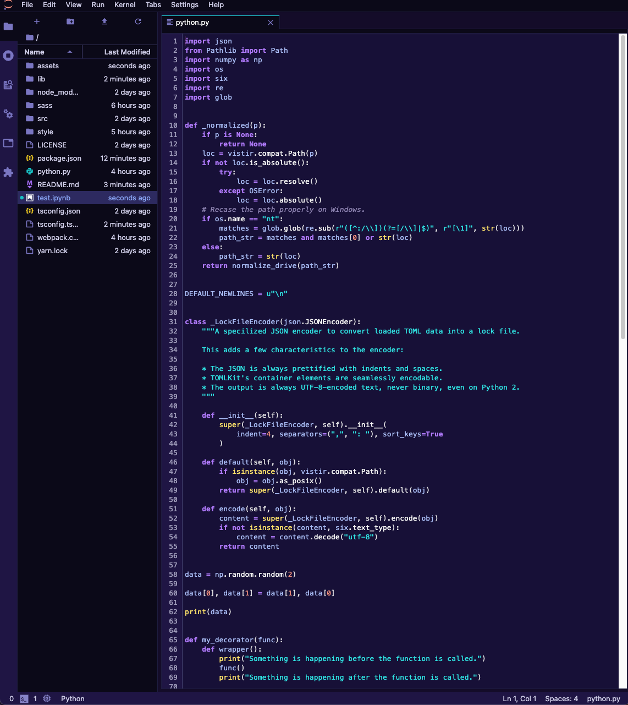
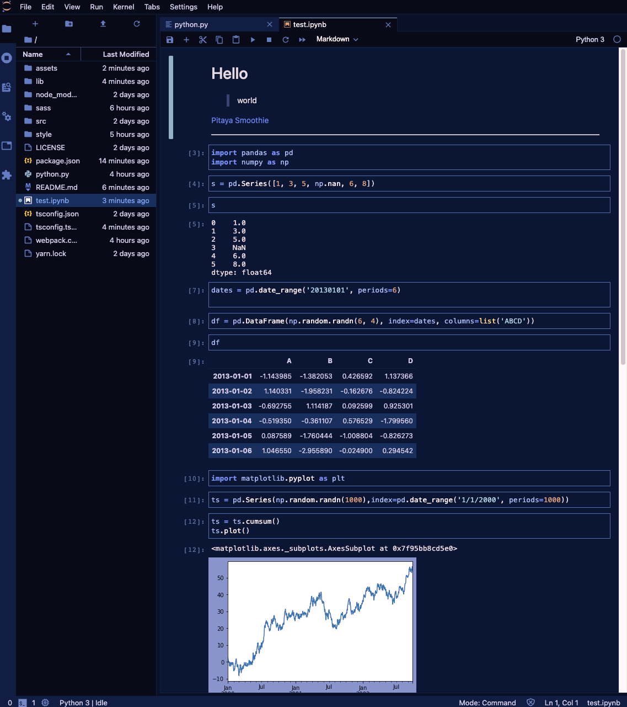
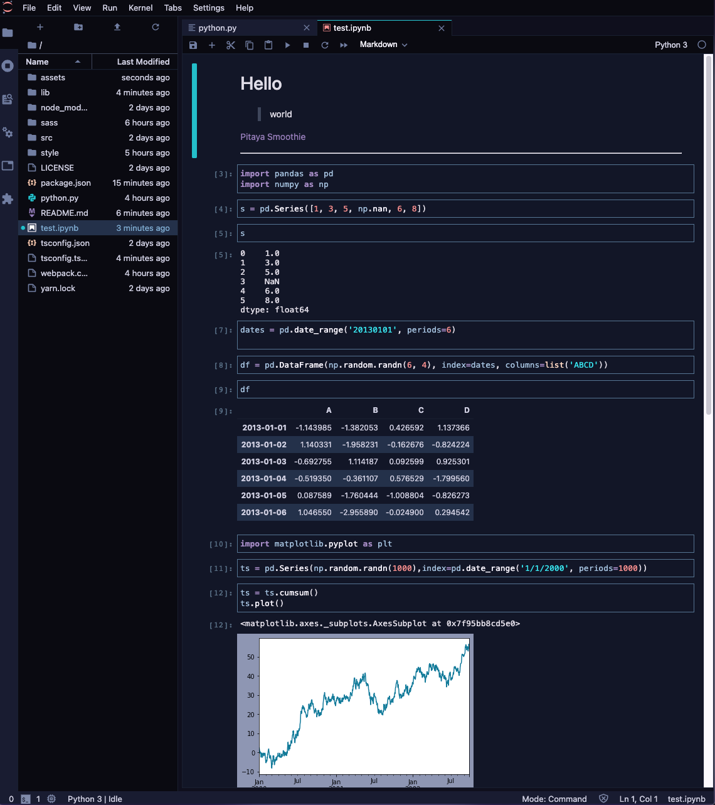
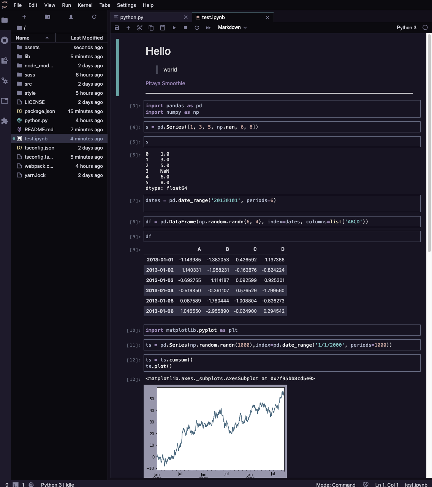

<div align="center">
 
</div>
<br>

<div align="center">
 
</div>
<br>


# JupyterLab Pitaya Smoothie


<table width='100%' align="center">
 <tr>
 <td align='left' width='100%' colspan='2'>
 A professional JupyterLab theme with hand-picked & bold colours for JupyterLab. The theme is heavily inspired by the <a href="https://www.pantone.com/color-intelligence/color-of-the-year/color-of-the-year-2018">Pantone colour of the year 2018</a> and the Outrun aesthetics.
 However, colours are on the pastel side to help provide contrast and highlight what is essential.
 Color choices have taken into consideration what is accessible to people with colorblindness and in low-light circumstances.
 </td>
 </tr>
 <tr>
 <td>
 A FOSS (Free & Open Source Software) project developed by <a href='https://github.com/trallard' target="_blank">Tania Allard</a>.
 </td>
 <td align='center'>
 <a target="_blank" href='https://bitsandchips.me/'>
 
 </a>
 </td>
 </tr>
 <tr><td><sup> Follow Tania's #FOSS work on GitHub <a href='https://github.com/trallard'>@trallard</a> — Say Hi on Twitter <a href="https://twitter.com/ixek/">@ixek</a></sup></td><td align='center'> <a target="_blank" href='https://bitsandchips.me/'>👋 </a></td></tr>
</table>

For more details about the core theme colours and the such check out the main theme repository: [https://github.com/trallard/pitaya_smoothie](https://github.com/trallard/pitaya_smoothie)

## Prerequisites

* JupyterLab

## Installation 

```bash
jupyter labextension install @trallard/jupyter_pitaya_smoothie
```

You can check that the extension has been properly installed and enabled by running the following command in your command line:

```bash
jupyter labextension list
```

:sparkles: To enable the theme in JupyterLab:
Go to `Settings -> JupyterLab Theme -> Jupyter Pitaya Smoothie`

To enable the theme's scrollbars choose any of:

- Navigate to `Settings -> Advanced Settings Editor -> Theme` then in `User preferences` add `"theme-scrollbars: true"
- Check `Settings -> JupyterLab Theme -> Theme Scrollbars`

## Snapshots 
















## Development 

For a development install (requires npm version 4 or later), do the following in the repository directory:

```bash
npm install
jupyter labextension link .
```

To rebuild the package and the JupyterLab app:

```bash
npm run build
jupyter lab build
```
## Contributing 

🚧 This project is always a work in progress, and everyone is welcome and encouraged to collaborate in it. 🚧

Everyone should follow our [code of conduct](./CODE_OF_CONDUCT.md) and check out our [contributing guidelines](CONTRIBUTING.md) for more information on how to get started.

## License 

**Licensed** as BSD-3 ⓒ [Tania Allard](https:/trallard.dev/).

## Attributions 

- Icons made by <a href="https://www.flaticon.com/authors/freepik" title="Freepik">Freepik</a> from <a href="https://www.flaticon.com/" title="Flaticon">www.flaticon.com</a> and adapted to match the theme's colours.

- The logo font is Attractype Reborn from [Garisman Studio](https://befonts.com/designer/garisman-studio).
